# Лабораторная работа №6 "Система контроля версий"

## Содержание отчёта
1. [Цель работы](#Цель-работы)
2. [Порядок выполнения лабораторной работы](#Порядок-выполнения-лабораторной-работы)
3. [Ход выполнения работы](#Ход-выполнения-работы)
4. [Лог команд](#Лог-команд)
5. [История операций в форматированном виде](#История-операций-в-форматированном-виде)
6. [Вывод](#Вывод)

## Цель работы
Изучение базовых возможностей системы управления версиями, опыт работы с Git Api, опыт работы с локальным и удаленным репозиторием.

## Порядок выполнения лабораторной работы
1. Создать аккаунт на сайте GitHub.
2. Сделать копию в личное хранилище из
https://github.com/Kurtyanik/LR6/ (Fork).
3. Установить Git (https://git-scm.com/).
4. После установки настроить клиент git, введя имя пользователя (Группа
Фамилия И.О.) и email.
5. Клонировать свой личный удалённый репозиторий на компьютер.
6. Добавить файл через интерфейс GitHub. Подтянуть изменения в
локальный репозиторий.
Работу продолжать локально.
7. Получить историю операций для каждой из веток.
8. Просмотреть последние изменения.
9. Выполнить слияние в ветку master, разрешив конфликт (можно
использовать специальные редакторы или графический интерфейс git).
10. Удалить побочную ветку после успешного слияния.
11. Сделать изменения и зафиксировать их, оставляя комментарии, несколько раз.
12. Сделать откат коммита.
13. Создать ветку для отчёта. 
14. Начать оформлять отчёт в файле README.md (разрешены сторонние
редакторы с подсветкой синтаксиса), используя markdown синтаксис
(https://guides.github.com/features/mastering-markdown/):
 - В отчёте должен быть снимки экрана консоли и сторонних программ.Файлы снимков экрана разместить в отдельной папке.
 - Лог команд (без результатов их выполнения).
При написании отчёта периодически делать коммиты, не забывать
комментировать.
15. Получить историю операций в форматированном виде (сокращённый
хэш + дата + имя автора + комментарий). Добавить её в отчёт и сделать
финальную фиксацию изменений.
16. Отправить локальные изменения в сетевое хранилище GitHub (если
делаете работу постепенно, то синхронизацию проводить в конце рабочего
сеанса) 

## Ход выполнения работы
### 1. Cоздание аккаунта на GitHub
Аккаунтуже был создан, поэтому прилагается скриншот аккаунта (рис.1).
<p align="center">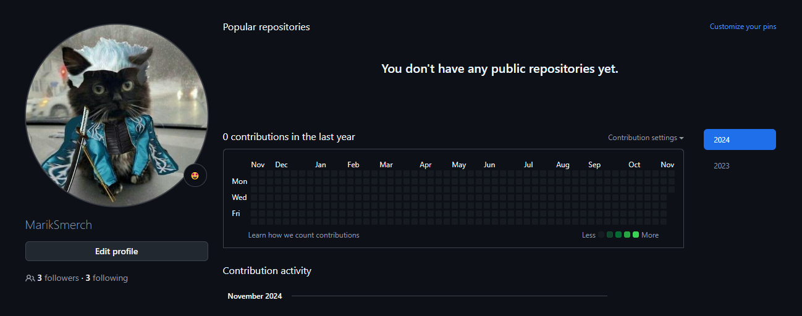</p>
<p align="center">Рисунок 1 - Зарегистрированный аккаунт на GitHub</p>


### 2. Создание копии в личном хранилище из https://github.com/Kurtyanik/LR6/ (Fork).

Следующим шагом является создание копии репозитория. Для этого нужно перейти на репозиторий преподавателя, указать параметры копирования и создать копию (fork) (рис. 2).
<p align="center">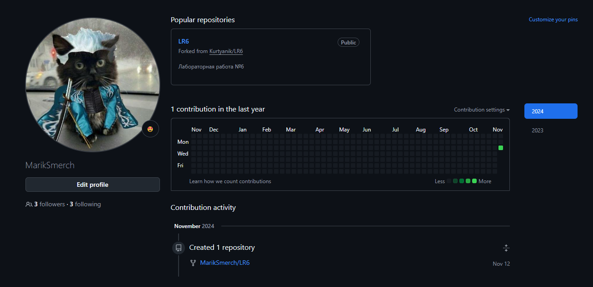</p>
<p align="center">Рисунок 2 - Скопированный репозиторий</p>

### 3. Установка Git
Чтобы установить Git, необходимо перейти на страницу https://git-scm.com и установить (рис.3).
<p align="center">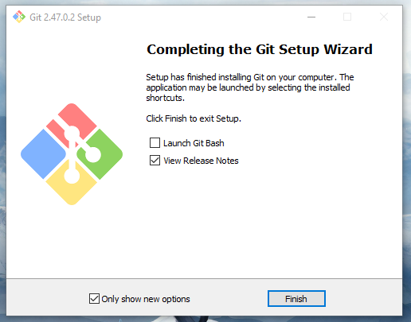</p>
<p align="center">Рисунок 3 - Установление Git</p>

### 4. Настройка клиента Git
Чтобы указать имя пользователя и email в клиенте Git, необходимо воспользоваться соответствующими командами:
```
git config --global user.name "(username)"
git config --global user.email "(email)"
```
Настройка клиента Git представлена на рисунке 4.
<p align="center">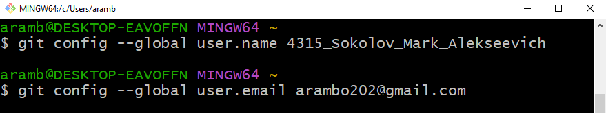</p>
<p align="center">Рисунок 4 - Настройка клиента git</p>

### 5. Клонирование удалённого репозитория на компьютер
Для того, чтобы клонировать удалённый репозиторий на компьютер нужно прописать команду (рис.5):
```
git clone (ссылка на удалённый репозиторий)
```
<p align="center">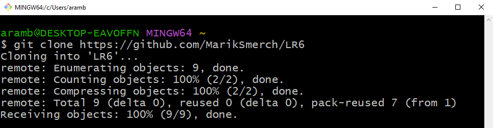</p>
<p align="center">Рисунок 5 - Клонирование удалённого репозитория на компьютер</p>

### 6. Добавление файла через интерфейс GitHub. Подтягивание изменений в локальный репозиторий
Чтобы добавить файл через интерфейс GitHub, нужно нажать на кнопку "Add file", а затем перейти в "Create new file" или "Upload files". Я добавил отчет по дисциплине ОПД, что видно на рисунках 6-7.
<p align="center">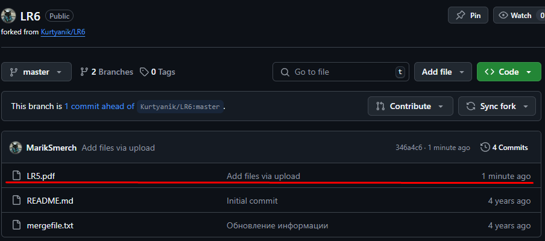</p>
<p align="center">Рисунок 6 - Новый файл на GitHub</p>

<p align="center">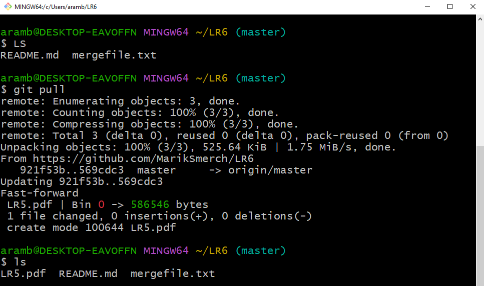</p>
<p align="center">Рисунок 7 - Новый файл в локальном репозитории</p>

### 7. Получение истории операций для каждой из веток
Чтобы получить историю операций для каждой ветки, необходимо на каждой ветки выполнить команду:
```
git log (Название ветки)
```
Так, при выполнении команды `git log master` в консоль выводится история операция для ветки master (рис. 11).

<p align="center">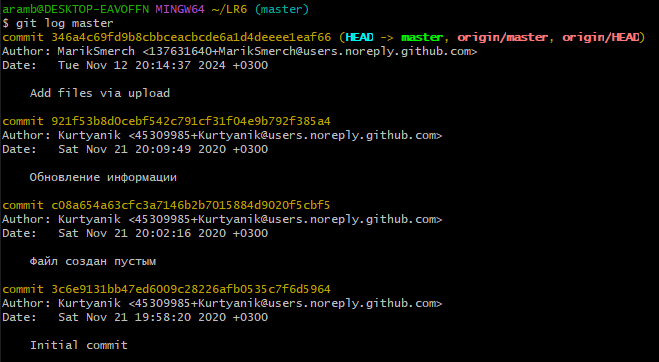</p>
<p align="center">Рисунок 8 - История операций ветки master</p>

Чтобы перейти на другую ветку можно воспользоваться командой:
``` 
git checkout (название ветки)
```
После перехода на ветку branch1 необходимо выполнить команду `git log branch1`, чтобы получить историю операций данной ветки (рис. 12).
<p align="center">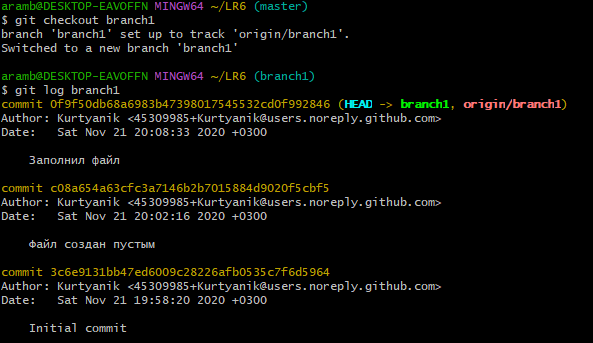</p>
<p align="center">Рисунок 9 - История операций ветки branch1</p>

### 8. Просмотр последних изменений
Чтобы просмотреть последние изменения, нужно на каждой ветке выполнить команду:
```
git show (Название ветки)
```
или просто находясь в ветке прописать:
```
git show
```
Находясь в ветке master прописал `git show master` (рис.10).
<p align="center">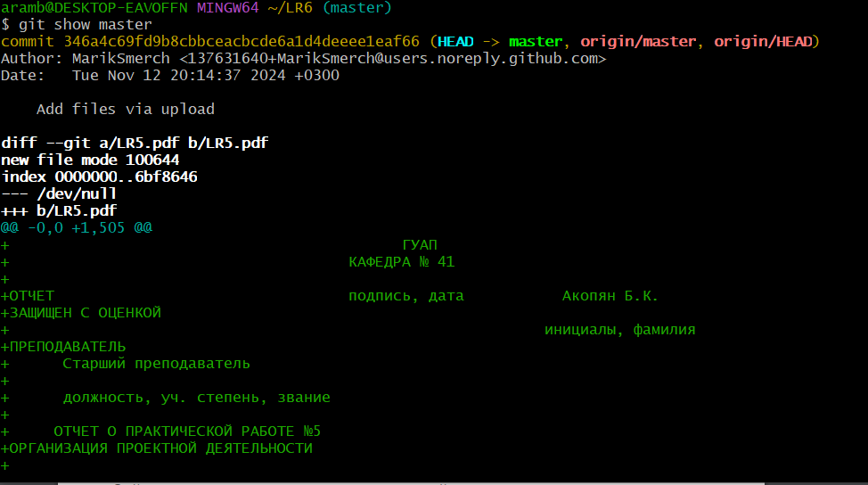</p>
<p align="center">Рисунок 10 - Последние изменения ветки master</p>

Затем перешел в ветку branch1 и прописал `git show` (рис.11).

<p align="center">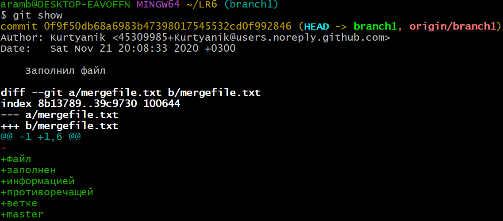</p>
<p align="center">Рисунок 11 - Последние изменения ветки branch1</p>

### 9. Выполнение слияния в ветку master, разрешив конфликт
Чтобы слить две ветки нужно перейти на ветку в которую нужно слить файлы со второй ветки и воспользоваться командой:
```
git merge (Название второй ветки)
```
При попытке слить в ветку master ветку branch1 возникает конфликт (рис. 12).
<p align="center">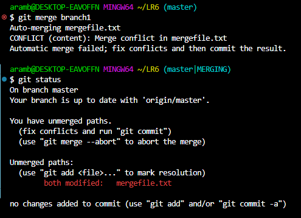</p>
<p align="center">Рисунок 12 - Появление конфликта при слияние</p>

Для просмотра конфликта был открыт Visual Studio Code (рис. 13).
<p align="center">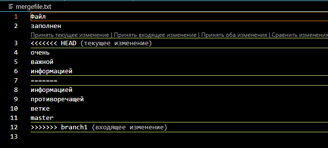</p>
<p align="center">Рисунок 13 - Ошибка слияния</p>

Для разрешения данного конфликта был использован Visual Studio Code. После того как конфликт разрешён, полученный файл необходимо зафиксировать. Для этого сначала добавляем его в индекс с помощью команды:
```
git add (Название файла)
```
Затем проверям, что он добавился в индекс:
```
git status
```
И последним шагом фиксируем изменения, чтобы завершить слияние (рис. 14) с помощью команды:
```
git commit -m "(Комментарий)"
```
Чтобы передать все изменения в ветке master в удалённый репозиторий (рис. 15), необходимо воспользоватсья командой:
```
git push
```
<p align="center">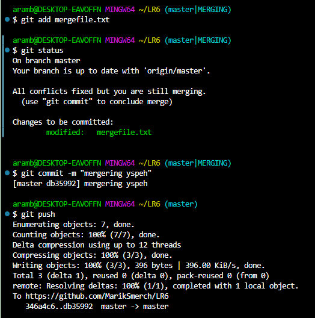</p>
<p align="center">Рисунок 14 - Завершение слияния веток</p>

<p align="center">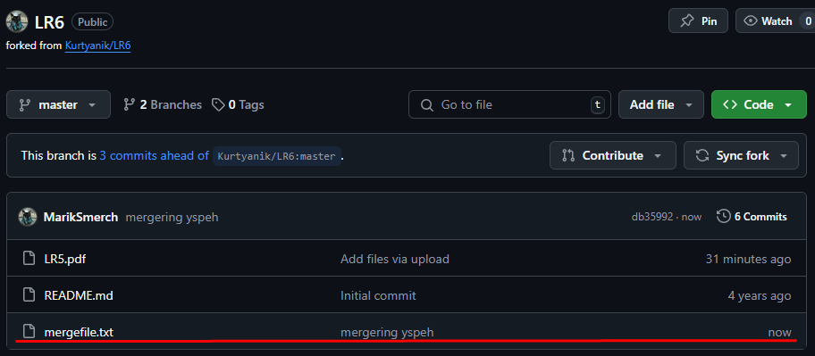</p>
<p align="center">Рисунок 15 - Файл на GitHub</p>

### 10. Удаление побочной ветки 
После успешного слияния ветка branch1 больше не нужна и её нужно удалить (рис. 16). 

Сначала её нужно удалить локально с помощью команды:
```
git branch -d (Название ветки)
```
Затем она была удалена в удалённом репозитории в GitHub.
<p align="center">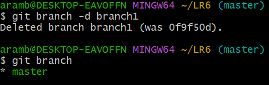</p>
<p align="center">Рисунок 16 - Удаление ветки branch1</p>

### 11. Создание изменений и их фиксация (с комментариями);
В Visual Studio Code был создан новый файл "new" (рис. 17).
<p align="center">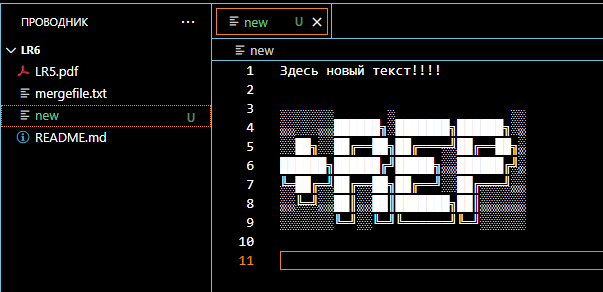</p>
<p align="center">Рисунок 17 - Новый файл "new"</p>

Также эти изменения были отправлены на удалённый репозиторий (рис. 18-19).
<p align="center">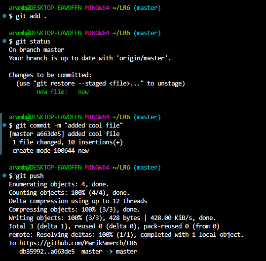</p>
<p align="center">Рисунок 18 - Отправка файла</p>

<p align="center">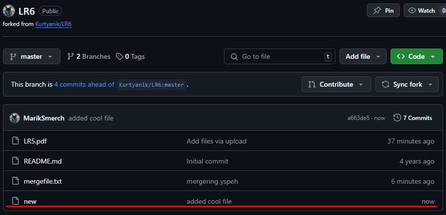</p>
<p align="center">Рисунок 19 - Новый файл "new" GitHub</p>

### 12. Создание отката коммита
Для отката последнего коммита необходимо воспользоваться командой:
```
git reset --soft HEAD~1
```
или 
```
git reset --hard HEAD~1
```
В ходе лабораторной работы было создано 3 коммита с новым файлом (рис. 20) и использовано две эти команды (рис. 21-22). Также результаты этих команды (рис.23-24).
<p align="center">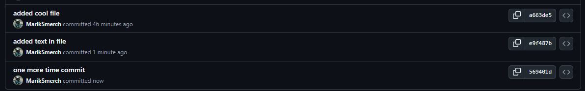</p>
<p align="center">Рисунок 20 - 3 коммита</p>

<p align="center">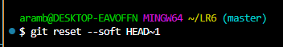</p>
<p align="center">Рисунок 21 - Использование команды для отката</p>

<p align="center">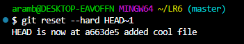</p>
<p align="center">Рисунок 22 - Использование команды для отката</p>

<p align="center">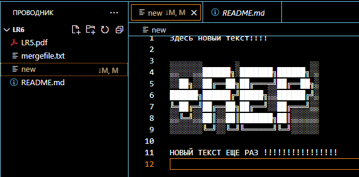</p>
<p align="center">Рисунок 23 - Первый откат</p>

<p align="center">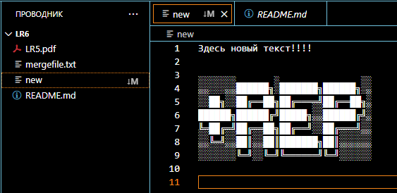</p>
<p align="center">Рисунок 24 - Второй откат</p>

### 13. Создание ветки для отчёта
Для создания ветки для отчёта (рис. 25) необходимо воспользоваться командой:
```
git branch (Название новой ветки)
```
А чтобы посмотреть какие существуют ветки (рис. 25), можно воспользоватсья командой:
```
git branch
```
<p align="center">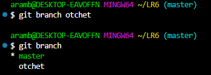</p>
<p align="center">Рисунок 25 - Создание и проверка веток</p>

Чтобы недавно созданная локальная ветка otchet появилась в удалённом репозитории (рис. 26), нужно воспользоваться командой:
```
git push origin otchet
```
<p align="center">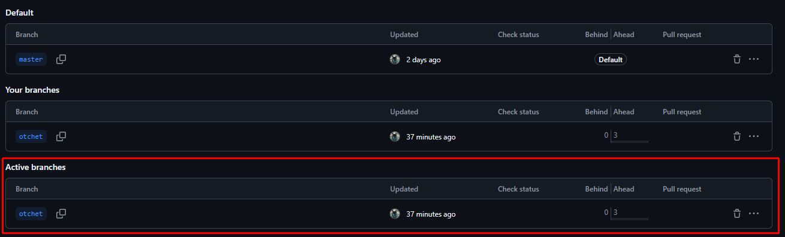</p>
<p align="center">Рисунок 26 - Отправка изменений в удалённый репозиторий</p>

### 14. Начало оформления отчёта в файле README.md
Ещё одним важным требованием для выполнения лабораторной работы является написание отчёта в файле README.md. Для удобного форматирования этого файла был выбран редактор кода VS Code

### 15. Получение истории операций в форматированном виде
Чтобы получить историю операций в форматированном виде (рис. 28) (сокращённый
хэш + дата + имя автора + комментарий), необходимо воспользоваться командой:
```
git log --date=format:'%D' --pretty=format:"%h -> %cd, %cn ( %s )"
```

<p align="center">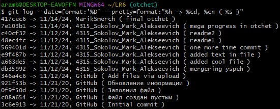</p>
<p align="center">Рисунок 27 - История операций в форматированном виде</p>

### 16. Отправка локальных изменений в сетевое хранилище GitHub
Чтобы отправить локальные изменения в сетевое хранилище GitHub после завершения написания отчёта нужно воспользоваться командой: 
```
git push
```
После чего все локальные изменения ветки otchet появятся в удалённом репозитории

## Лог команд
<p>git config --global user.name "4315_Sokolov_Mark_Alekseevich"
<p>git config --global user.email "arambo202@gmail.com"
<p>cd 
<p>git clone https://github.com/MarikSmerch/LR6
<p>ls 
<p>git pull
<p>ls 
<p>git log master
<p>git checkout branch1
<p>git log branch1
<p>git checkout master
<p>git show 
<p>git checkout branch1
<p>git show master
<p>git checkout master
<p>git merge branch1
<p>git status
<p>git add mergefile.txt
<p>git add .
<p>git commit -m "mergering yspeh"
<p>git push
<p>git branch -d branch1
<p>git branch
<p>git status
<p>git add .
<p>git commit -m "added cool file"
<p>git push
<p>git status
<p>git add .
<p>git commit -m "added text in file"
<p>git push
<p>git status
<p>git add .
<p>git commit -m "one more time commit"
<p>git push
<p>git reset --soft HEAD~1
<p>git reset --hard HEAD~1
<p>git branch otchet
<p>git branch
<p>git checkout otchet
<p>git push origin otchet
<p>git add .
<p>git commit -m "readme1"
<p>git push
<p>git add .
<p>git commit -m "readme2"
<p>git push
<p>git add .
<p>git commit -m "mega progress in otchet"
<p>git push
<p>git log --date=format:'%D' --pretty=format:"%h -> %cd, %cn ( %s )"

## История операций в форматированном виде
7e103b1 -> 11/14/24, 4315_Sokolov_Mark_Alekseevich ( mega progress in otchet )

c40cf32 -> 11/12/24, 4315_Sokolov_Mark_Alekseevich ( readme2 )

48ec4fc -> 11/12/24, 4315_Sokolov_Mark_Alekseevich ( readme1 )

569401d -> 11/12/24, 4315_Sokolov_Mark_Alekseevich ( one more time commit )

e9f487b -> 11/12/24, 4315_Sokolov_Mark_Alekseevich ( added text in file )

a663de5 -> 11/12/24, 4315_Sokolov_Mark_Alekseevich ( added cool file )

db35992 -> 11/12/24, 4315_Sokolov_Mark_Alekseevich ( mergering yspeh )

346a4c6 -> 11/12/24, GitHub ( Add files via upload )

921f53b -> 11/21/20, GitHub ( Обновление информации )

0f9f50d -> 11/21/20, GitHub ( Заполнил файл )

c08a654 -> 11/21/20, GitHub ( Файл создан пустым )

3c6e913 -> 11/21/20, GitHub ( Initial commit )


## Вывод
В ходе данной лабораторной работы были изучены базовые возможности системы управления версиями, а также получен опыт работы с Git Api и опыт работы с локальным и удаленным репозиторием. 

Была изучена система контроля версий Git и её интеграция с платформой GitHub. Получен практический опыт в использовании ключевых функций Git: создание и клонирование репозиториев, объединение веток, разрешение конфликтов, а также ведение и анализ истории изменений с форматированным отображением операций.

